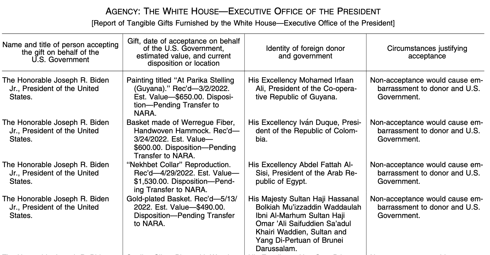
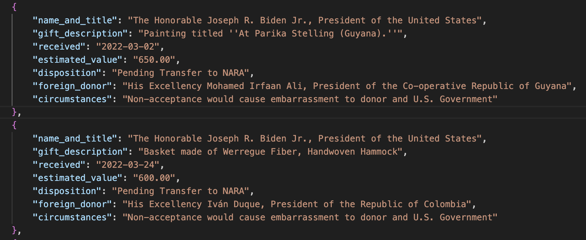
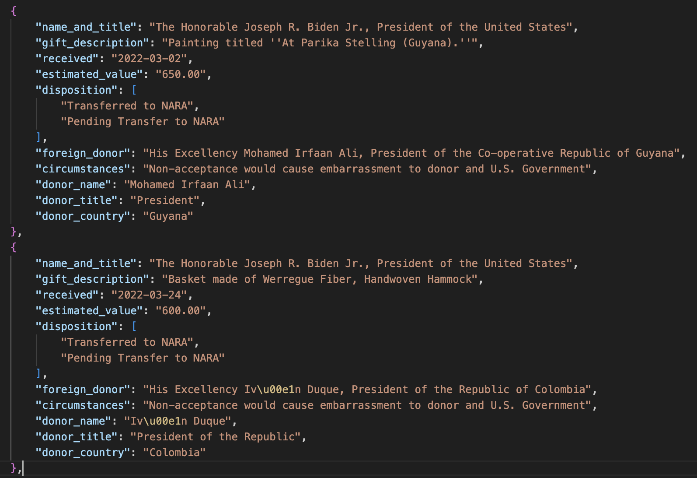

# Turning Text into Data with Large Language Models
## IRE 2024
### Derek Willis, University of Maryland
#### dpwillis@umd.edu
#### https://github.com/dwillis/all-foreign-gifts-around-us

## The Problem

Lots of government information _should_ be data, but doesn't come in that format. Often it's stored inside PDF files, but it's even worse: what obviously should be structured as clean rows and columns is anything but. That leaves reporters with a series of bad options:

* Spending a lot of time trying to correctly copy and paste information from one format to another
* Literally re-typing stuff that has already been typed!
* Limiting reporting to anecdotes, not data
* Regular expressions! (Now you have two problems)

The worst part is that you can see how this information should be structured. Getting there is another matter.

For example, a page like this:



Clearly this is structured information, but the fact that the text wraps over to multiple lines and columns often contain multiple pieces of information is a problem. There is a solution!

## A Large Language Model Solution

One thing that most LLMs are pretty good at is taking information in one context and putting it into another one. That includes translation, switching language style/meter/tone and even reproducing original text in another's voice (try this with Dr. Seuss!). That ability extends to restructuring data like the file from above. Given the proper prompts and source material, an LLM should be able to produce something like this:



That's a JSON file, which is a common format for storing data on the Web. It's like a spreadsheet but more flexible.

You _can_ try and upload a PDF directly to an LLM - a lot of them will be able to handle that well - but I encourage you to get as close to a text version of the PDF as possible, preserving the layout as much as you can. There are various ways you can do this; I used a command-line utility called `pdftotext` to convert a PDF to plain text. A typical command would look like this:

`pdftotext -layout 2024-03129.pdf`

That would produce a text file called `2024-03129.txt` that looks like [this](text/2024-03129.txt).

That text is what you want to provide to an LLM. For this task I chose Claude, specifically the Claude 3 Sonnet model. It costs $20 a month if you want file uploads and other goodies, but you also should be able to paste text into the chat window or API playground. If you have a single PDF, you might want to go that route. If you have multiple PDFs, you probably want to do this programatically using the API. But don't worry about that yet - we're just trying to do one file successfully.

## The Prompt

Having the original file as text is necessary for this task, but it's not sufficient. You need to be able to describe to an LLM what you want it to do. That's where reporters should be able to shine: we may not know the answer, but we know the questions. When you are crafting a prompt, you're asking a question (even if you don't phrase it that way).

Most LLMs have two types of prompts: a `system` prompt and a `user` prompt. You should think about the former as a set of rules that will apply to everything you want an LLM to do. For example, if you only want it to produce a CSV file, put that in the system prompt. Here's my system prompt for this task:

`create only valid JSON objects based on the provided text and example. Never include any additional text or explanation. Always use double-quotes for every key and value. No yapping, no hallucinations.`

You want to use simple, direct language here, words like "only", "never" and "always" are good. The final phrase - "no yapping" is something that most LLMs will recognize as an instruction to cut down on wordiness like the narration they often provide. "No hallucinations" may not always work, but it doesn't hurt to include.

I'm almost ready to describe the specific task, but first I want to talk about the importance of providing examples, especially when restructuring information. Think of it this way: you're giving it a before example (the original text) and an after example (the structure you want). That will help guide the LLMs work. Example outputs are really, really helpful. Here's what I provided in my prompt:

```
example_json = {
                "name_and_title": "name and title of the recipient",
                "gift_description": "the gift",
                "received": "the date received in yyyy-mm-dd format",
                "estimated_value": "the dollar value only, no dollar sign",
                "disposition": "the disposition of the gift, not including 'Disposition-'",
                "foreign_donor": "name and title of foreign donor",
                "circumstances": "why the gift was accepted"
            }
```

You'll notice that most of these are descriptive, not literal examples. You should try either approach; this one is a mix of the two. The balance is being general enough that the LLM can recognize the overall pattern and specific enough that it doesn't give you additional information you don't want.

Finally, here's my user prompt:

`Extract all Tangible Gifts contained in the following text into individual JSON objects based on this example: {example} {text}`

Each time I insert the example and the text of the PDF I'm working with.

## It Works! (Mostly)

Mostly, this approach worked for me, but sometimes Claude ignored my instructions by giving me introductory text like `Here are the JSON objects for the Tangible Gifts extracted from the provided text:` before listing the data. I spent time trying to tweak the prompts to get it not to do this, but couldn't prevent it all the time. In the end, I declared victory and removed the extra text manually. It's not perfect, but it saved me a LOT of time.

How do I know it (mostly) worked? I conducted spot-checks on every file, comparing the results to originals. Consider this the fact-checking portion of the reporting process. It's very easy to be so impressed by an LLM's abilities that you implicitly trust its output. DON'T DO THIS. Trust your reporter instincts, not a machine, and verify.

I ended up doing a couple of more extraction tasks on the JSON it produced so that I could have more granular data (separate names and titles, for example). In all, it took me a few hours and cost about $10 to do this via Claude's API. Here's what the final product looks like:



Next year, when the federal government publishes its latest update of these gifts, I can grab that PDF, turn it into text and extract the data. It might take me 10 minutes to clean things up, and then I'll have even more data. You can see all of the scripts and data [here](https://github.com/dwillis/all-foreign-gifts-around-us).

You may not need a full pipeline like this. You might just need to work on a single PDF or text file. Don't let that stop you from trying out these tools. Find the process that works for you.

## Links

* Anthropic: home to the Claude models
* Groq: a service that provides access to multiple LLMs. Web-based and very fast, but also can do API stuff.
* Jan: a Mac OS app that you can use to run models locally (helps if you have a recent Mac computer)